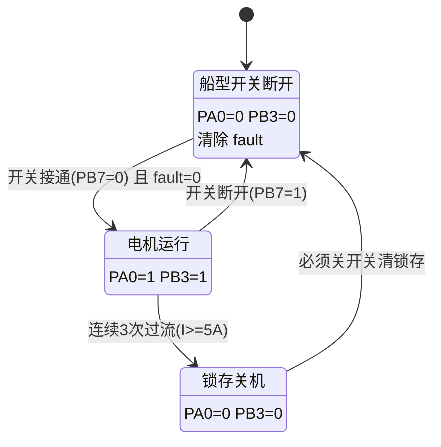
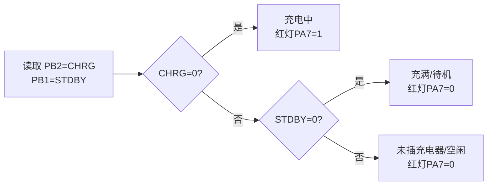

# 程序功能图（商用交付版）

> 说明：本工程基于 Protothread(process/etimer) 实现“事件驱动 + 周期任务”的控制架构。

---

## 1. 总体功能框图

```mermaid
flowchart TD
  PWR[上电/复位] --> INIT[初始化: HAL/BSP/GPIO/ADC/IWDG/PT]
  INIT --> LOOP[主循环: protothread_mainLoop]

  subgraph PT[Protothread 进程调度]
    CTRL[app_ctrl_process
20ms] -->|读取 PB7| SW{船型开关 ON?}
    SW -->|否| OFF[电机关闭
PA0=0
PB3=0
清除锁存]
    SW -->|是| FAULT{过流锁存?}
    FAULT -->|是| LATCH_OFF[锁存关机
PA0=0
PB3=0]
    FAULT -->|否| RUN[电机使能
PA0=1
PB3=1]
    RUN --> IADC[采样电流
PA3 ADC_IN1]
    IADC --> OC{I >= 5A ?}
    OC -->|否| RUN
    OC -->|是| CNT[累计超限计数]
    CNT -->|连续>=3次| LATCH_SET[置位锁存 fault=1
关机]

    CHG[app_charge_process
200ms] --> TP[读取 TP4056
PB2=CHRG
PB1=STDBY]
    TP --> CHGSTATE{充电中?}
    CHGSTATE -->|是| RON[红灯亮
PA7=1]
    CHGSTATE -->|否| ROFF[红灯灭
PA7=0]

    DIAG[app_diag_process
1s] --> PRINT[串口打印状态
sw/fault/i/vbat]

    WDG[app_iwdg_process
200ms] --> FEED[喂狗 HAL_IWDG_Refresh]
  end

  LOOP --> PT

  subgraph TICK[系统时基]
    SYSTICK[SysTick_Handler 1ms] --> INC[HAL_IncTick]
    INC --> POLL[etimer_request_poll
(到期时触发)]
  end

  TICK --> PT
```

---

## 2. 电机控制状态机



---

## 3. 充电状态识别逻辑（TP4056 真值表）



---

## 4. 关键保护点

- **过流保护**：
  - 阈值：`I >= 5A`
  - 连续确认：`3` 次（20ms 周期）
  - 动作：立即关闭电机并锁存
  - 恢复：必须船型开关 OFF 清除锁存

- **看门狗 IWDG**：
  - 超时：约 2s
  - 喂狗：200ms
  - 目的：防止软件死锁导致电机失控

