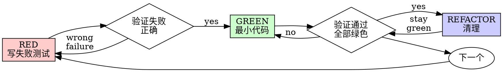

# 测试驱动开发 (TDD)

## 概述

先写测试。看它失败。写最小代码通过。

**核心原则：** 如果你没有看测试失败，你不知道它是否测试正确的东西。

**违反规则的字面意思就是违反规则的精神。**

## 何时使用

**总是：**
- 新功能
- Bug修复
- 重构
- 行为改变

**例外（询问你的合作伙伴）：**
- 一次性原型
- 生成代码
- 配置文件

想“就这一次跳过TDD”？停下。那是合理化。

## 铁律

```
没有失败的测试就不要写生产代码
```

在测试之前写代码？删除它。从头开始。

**没有例外：**
- 不要作为“参考”保留它
- 不要在写测试时“适应”它
- 不要看它
- 删除意味着删除

从测试新鲜实施。句号。

## 红-绿-重构



### RED - 写失败测试

写一个最小测试显示应该发生什么。

<Good>
```typescript
test('retries failed operations 3 times', async () => {
  let attempts = 0;
  const operation = () => {
    attempts++;
    if (attempts < 3) throw new Error('fail');
    return 'success';
  };

  const result = await retryOperation(operation);

  expect(result).toBe('success');
  expect(attempts).toBe(3);
});
```
清晰名称，测试真实行为，一件事
</Good>

<Bad>
```typescript
test('retry works', async () => {
  const mock = jest.fn()
    .mockRejectedValueOnce(new Error())
    .mockRejectedValueOnce(new Error())
    .mockResolvedValueOnce('success');
  await retryOperation(mock);
  expect(mock).toHaveBeenCalledTimes(3);
});
```
模糊名称，测试mock不是代码
</Bad>

**要求：**
- 一个行为
- 清晰名称
- 真实代码（除非不可避免，否则不mock）

### 验证RED - 看它失败

**强制。永远不要跳过。**

```bash
npm test path/to/test.test.ts
```

确认：
- 测试失败（不是错误）
- 失败消息是预期的
- 因为功能缺失失败（不是拼写错误）

**测试通过？** 你在测试现有行为。修复测试。

**测试错误？** 修复错误，重新运行直到它正确失败。

### GREEN - 最小代码

写最简单代码通过测试。

<Good>
```typescript
async function retryOperation<T>(fn: () => Promise<T>): Promise<T> {
  for (let i = 0; i < 3; i++) {
    try {
      return await fn();
    } catch (e) {
      if (i === 2) throw e;
    }
  }
  throw new Error('unreachable');
}
```
刚好足够通过
</Good>

<Bad>
```typescript
async function retryOperation<T>(
  fn: () => Promise<T>,
  options?: {
    maxRetries?: number;
    backoff?: 'linear' | 'exponential';
    onRetry?: (attempt: number) => void;
  }
): Promise<T> {
  // YAGNI
}
```
过度工程
</Bad>

不要添加功能、重构其他代码，或超出测试“改进”。

### 验证GREEN - 看它通过

**强制。**

```bash
npm test path/to/test.test.ts
```

确认：
- 测试通过
- 其他测试仍然通过
- 输出纯净（没有错误、警告）

**测试失败？** 修复代码，不是测试。

**其他测试失败？** 现在修复。

### REFACTOR - 清理

只有绿色后：
- 移除重复
- 改进名称
- 提取助手

保持测试绿色。不要添加行为。

### 重复

下一个失败测试为下一个功能。

## 好测试

| 质量 | 好 | 坏 |
|---------|------|-----|
| **最小** | 一件事。“and”在名称中？拆分它。 | `test('validates email and domain and whitespace')` |
| **清晰** | 名称描述行为 | `test('test1')` |
| **显示意图** | 演示期望API | 模糊代码应该做什么 |

## 为什么顺序重要

**“我会在之后写测试来验证它工作”**

写在代码后的测试立即通过。通过立即证明不了什么：
- 可能测试错误东西
- 可能测试实现，不是行为
- 可能错过你忘记的边缘案例
- 你从未看到它捕获bug

测试先强制你看到测试失败，证明它实际上测试了什么。

**“我已经手动测试了所有边缘案例”**

手动测试是ad-hoc。你认为你测试了一切但：
- 没有记录你测试了什么
- 当代码改变时不能重新运行
- 在压力下容易忘记案例
- “当我试它时工作” ≠ 全面

自动化测试是系统性的。它们每次运行相同方式。

**“删除X小时工作是浪费”**

沉没成本谬误。时间已经过去了。你现在的选择：
- 删除并用TDD重写（X更多小时，高信心）
- 保留它并之后添加测试（30分钟，低信心，可能bug）

“浪费”是保留你不能信任的代码。没有真实测试的工作代码是技术债务。

**“TDD是教条的，务实意味着适应”**

TDD是务实的：
- 在提交前发现bug（比之后调试快）
- 防止回归（测试立即捕获中断）
- 文档行为（测试显示如何使用代码）
- 启用重构（自由改变，测试捕获中断）

“务实”捷径 = 在生产中调试 = 更慢。

**“之后测试实现相同目标 - 这是精神不是仪式”**

不。之后测试回答“这个做什么？” 测试先回答“这个应该做什么？”

之后测试偏向你的实现。你测试你构建的，不是要求的。你验证你记住的边缘案例，不是发现的。

测试先强制在实施前发现边缘案例。之后测试验证你记住了一切（你没有）。

30分钟之后测试 ≠ TDD。你得到覆盖，失去证明测试工作的证据。

## 常见合理化

| 借口 | 现实 |
|--------|---------|
| “太简单测试” | 简单代码中断。测试花30秒。 |
| “我会之后测试” | 测试立即通过证明不了什么。 |
| “之后测试实现相同目标” | 之后测试 = “这个做什么？” 测试先 = “这个应该做什么？” |
| “已经手动测试” | Ad-hoc ≠ 系统性。没有记录，不能重新运行。 |
| “删除X小时是浪费” | 沉没成本谬误。保留未验证代码是技术债务。 |
| “保留作为参考，先写测试” | 你会适应它。那是之后测试。删除意味着删除。 |
| “需要先探索” | 好。扔掉探索，用TDD开始。 |
| “测试难 = 设计不清楚” | 听测试。难测试 = 难使用。 |
| “TDD会慢我” | TDD比调试快。务实 = 测试先。 |
| “手动测试更快” | 手动不证明边缘案例。你会重新测试每个改变。 |
| “现有代码没有测试” | 你在改进它。为现有代码添加测试。 |

## 红旗 - 停下并从头开始

- 测试前代码
- 实施后测试
- 测试立即通过
- 不能解释为什么测试失败
- 测试“之后”添加
- 合理化“就这一次”
- “我已经手动测试它”
- “之后测试实现相同目的”
- “这是关于精神不是仪式”
- “保留作为参考”或“适应现有代码”
- “已经花X小时，删除是浪费”
- “TDD是教条的，我在务实”
- “这个不同因为...”

**所有这些意味着：删除代码。用TDD从头开始。**

## 示例：Bug修复

**Bug：** 空email被接受

**RED**
```typescript
test('rejects empty email', async () => {
  const result = await submitForm({ email: '' });
  expect(result.error).toBe('Email required');
});
```

**验证RED**
```bash
$ npm test
FAIL: expected 'Email required', got undefined
```

**GREEN**
```typescript
function submitForm(data: FormData) {
  if (!data.email?.trim()) {
    return { error: 'Email required' };
  }
  // ...
}
```

**验证GREEN**
```bash
$ npm test
PASS
```

**REFACTOR**
如果需要，为多个字段提取验证。

## 验证清单

在标记工作完成前：

- [ ] 每个新函数/方法有测试
- [ ] 在实施前看了每个测试失败
- [ ] 每个测试因预期原因失败（功能缺失，不是拼写错误）
- [ ] 写了最小代码通过每个测试
- [ ] 所有测试通过
- [ ] 输出纯净（没有错误、警告）
- [ ] 测试使用真实代码（只有不可避免时mock）
- [ ] 边缘案例和错误覆盖

不能检查所有框？ 你跳过了TDD。从头开始。

## 当卡住时

| 问题 | 解决方案 |
|---------|----------|
| 不知道如何测试 | 写期望API。写断言先。问你的合作伙伴。 |
| 测试太复杂 | 设计太复杂。简化接口。 |
| 必须mock一切 | 代码耦合太紧。使用依赖注入。 |
| 测试设置巨大 | 提取助手。仍然复杂？简化设计。 |

## 调试集成

发现bug？写失败测试重现它。跟随TDD循环。测试证明修复并防止回归。

永远不要没有测试修复bug。

## 测试反模式

当添加mock或测试工具时，阅读 @testing-anti-patterns.md 避免常见陷阱：
- 测试mock行为而不是真实行为
- 添加测试专用方法到生产类
- 没有理解依赖就mock

## 最终规则

```
生产代码 → 测试存在并先失败
否则 → 不是TDD
```

没有你的合作伙伴许可，没有例外。